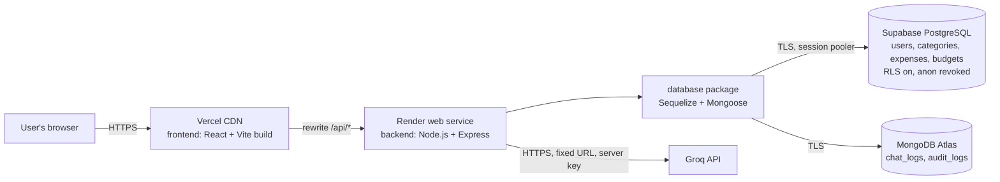

# Architecture

```mermaid
flowchart LR
  U[User's browser] -->|HTTPS| V[Vercel CDN<br/>frontend: React + Vite build]
  V -->|rewrite /api/*| R[Render web service<br/>backend: Node.js + Express]
  R --> D[database package<br/>Sequelize + Mongoose]
  D -->|TLS, session pooler| S[(Supabase PostgreSQL<br/>users, categories, expenses, budgets<br/>RLS on, anon revoked)]
  D -->|TLS| M[(MongoDB Atlas<br/>chat_logs, audit_logs)]
  R -->|HTTPS, fixed URL, server key| G[Groq API]
```
