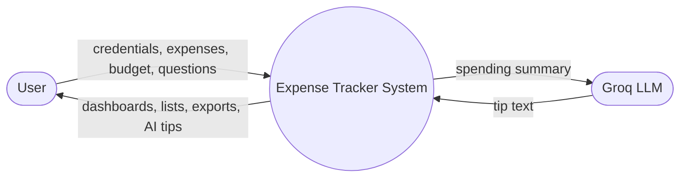

# DFD level 0 (context diagram)

```mermaid
flowchart LR
  U([User]) -- credentials, expenses, budget, questions --> S((Expense Tracker System))
  S -- dashboards, lists, exports, AI tips --> U
  S -- spending summary --> G([Groq LLM])
  G -- tip text --> S
```
