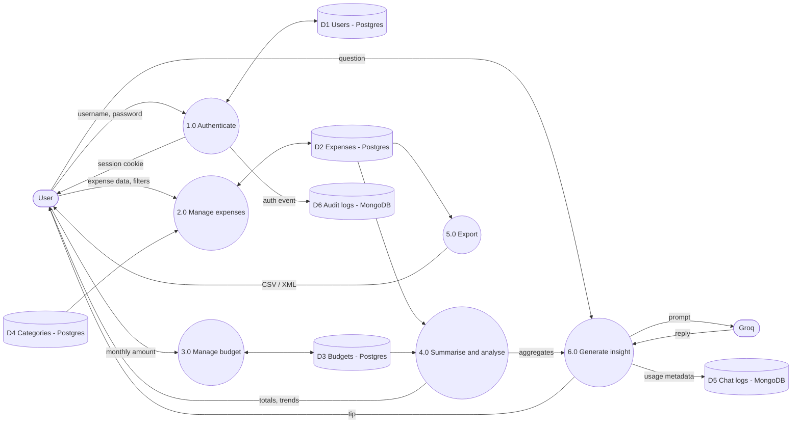

# DFD level 1

```mermaid
flowchart LR
  U([User])
  P1((1.0 Authenticate))
  P2((2.0 Manage expenses))
  P3((3.0 Manage budget))
  P4((4.0 Summarise and analyse))
  P5((5.0 Export))
  P6((6.0 Generate insight))
  D1[(D1 Users - Postgres)]
  D2[(D2 Expenses - Postgres)]
  D3[(D3 Budgets - Postgres)]
  D4[(D4 Categories - Postgres)]
  D5[(D5 Chat logs - MongoDB)]
  D6[(D6 Audit logs - MongoDB)]
  G([Groq])

  U -- username, password --> P1
  P1 <--> D1
  P1 -- auth event --> D6
  P1 -- session cookie --> U
  U -- expense data, filters --> P2
  P2 <--> D2
  D4 --> P2
  U -- monthly amount --> P3
  P3 <--> D3
  D2 --> P4
  D3 --> P4
  P4 -- totals, trends --> U
  D2 --> P5
  P5 -- CSV / XML --> U
  U -- question --> P6
  P4 -- aggregates --> P6
  P6 -- prompt --> G
  G -- reply --> P6
  P6 -- usage metadata --> D5
  P6 -- tip --> U
```
