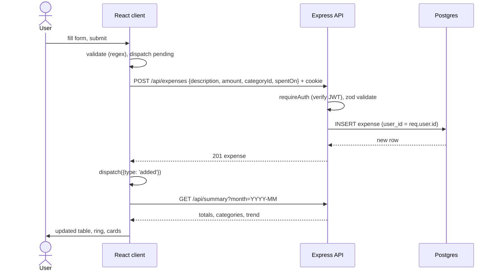

# Sequence: add expense

```mermaid
sequenceDiagram
  actor U as User
  participant C as React client
  participant A as Express API
  participant D as Postgres

  U->>C: fill form, submit
  C->>C: validate (regex), dispatch pending
  C->>A: POST /api/expenses {description, amount, categoryId, spentOn} + cookie
  A->>A: requireAuth (verify JWT), zod validate
  A->>D: INSERT expense (user_id = req.user.id)
  D-->>A: new row
  A-->>C: 201 expense
  C->>C: dispatch({type: 'added'})
  C->>A: GET /api/summary?month=YYYY-MM
  A-->>C: totals, categories, trend
  C->>U: updated table, ring, cards
```
