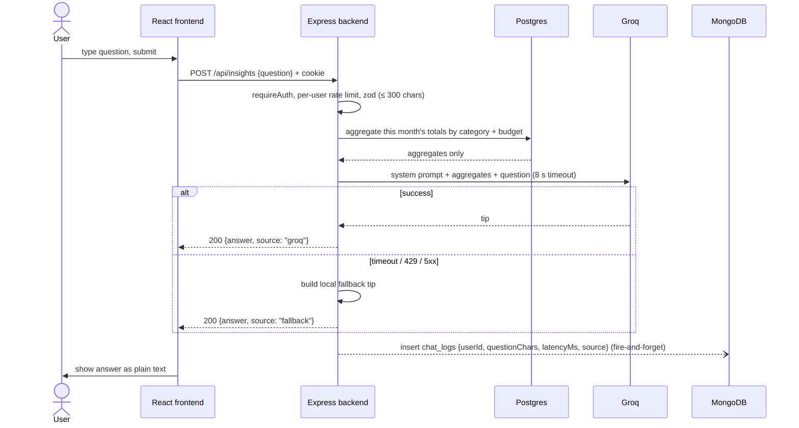

# Sequence: AI insight

```mermaid
sequenceDiagram
  actor U as User
  participant C as React frontend
  participant A as Express backend
  participant P as Postgres
  participant G as Groq
  participant M as MongoDB

  U->>C: type question, submit
  C->>A: POST /api/insights {question} + cookie
  A->>A: requireAuth, per-user rate limit, zod (≤ 300 chars)
  A->>P: aggregate this month's totals by category + budget
  P-->>A: aggregates only
  A->>G: system prompt + aggregates + question (8 s timeout)
  alt success
    G-->>A: tip
    A-->>C: 200 {answer, source: "groq"}
  else timeout / 429 / 5xx
    A->>A: build local fallback tip
    A-->>C: 200 {answer, source: "fallback"}
  end
  A--)M: insert chat_logs {userId, questionChars, latencyMs, source} (fire-and-forget)
  C->>U: show answer as plain text
```
