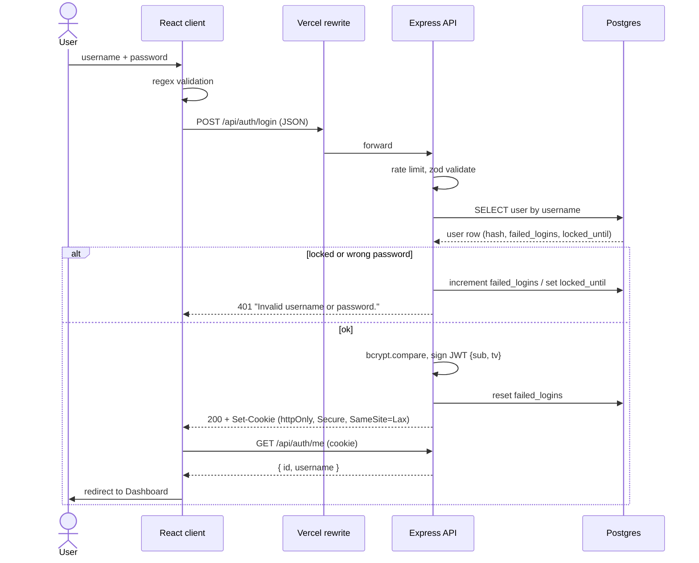

# Sequence: login

```mermaid
sequenceDiagram
  actor U as User
  participant C as React client
  participant V as Vercel rewrite
  participant A as Express API
  participant D as Postgres

  U->>C: username + password
  C->>C: regex validation
  C->>V: POST /api/auth/login (JSON)
  V->>A: forward
  A->>A: rate limit, zod validate
  A->>D: SELECT user by username
  D-->>A: user row (hash, failed_logins, locked_until)
  alt locked or wrong password
    A->>D: increment failed_logins / set locked_until
    A-->>C: 401 "Invalid username or password."
  else ok
    A->>A: bcrypt.compare, sign JWT {sub, tv}
    A->>D: reset failed_logins
    A-->>C: 200 + Set-Cookie (httpOnly, Secure, SameSite=Lax)
    C->>A: GET /api/auth/me (cookie)
    A-->>C: { id, username }
    C->>U: redirect to Dashboard
  end
```
