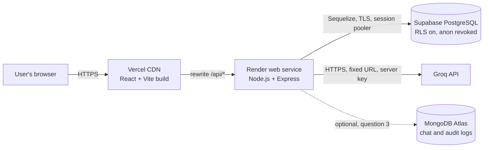

# Architecture

```mermaid
flowchart LR
  U[User's browser] -->|HTTPS| V[Vercel CDN<br/>React + Vite build]
  V -->|rewrite /api/*| R[Render web service<br/>Node.js + Express]
  R -->|Sequelize, TLS, session pooler| S[(Supabase PostgreSQL<br/>RLS on, anon revoked)]
  R -->|HTTPS, fixed URL, server key| G[Groq API]
  R -.->|optional, question 3| M[(MongoDB Atlas<br/>chat and audit logs)]
```
