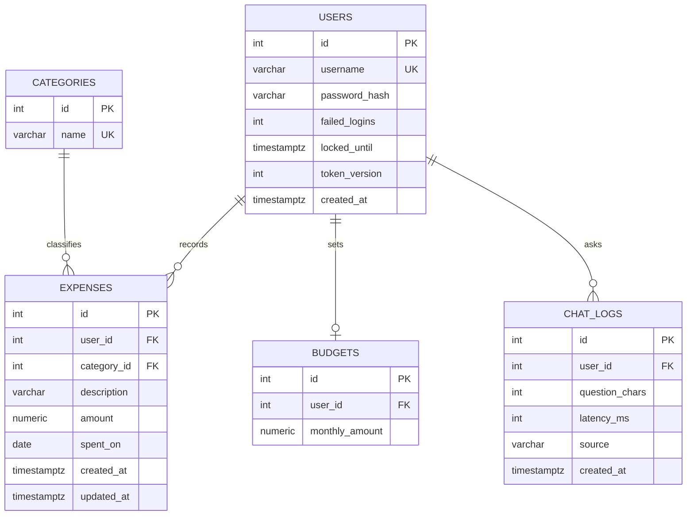

# ER diagram (draft, finalised in Phase 3)

```mermaid
erDiagram
  USERS ||--o{ EXPENSES : records
  USERS ||--o| BUDGETS : sets
  USERS ||--o{ CHAT_LOGS : asks
  CATEGORIES ||--o{ EXPENSES : classifies

  USERS {
    int id PK
    varchar username UK
    varchar password_hash
    int failed_logins
    timestamptz locked_until
    int token_version
    timestamptz created_at
  }
  CATEGORIES {
    int id PK
    varchar name UK
  }
  EXPENSES {
    int id PK
    int user_id FK
    int category_id FK
    varchar description
    numeric amount
    date spent_on
    timestamptz created_at
    timestamptz updated_at
  }
  BUDGETS {
    int id PK
    int user_id FK
    numeric monthly_amount
  }
  CHAT_LOGS {
    int id PK
    int user_id FK
    int question_chars
    int latency_ms
    varchar source
    timestamptz created_at
  }
```
